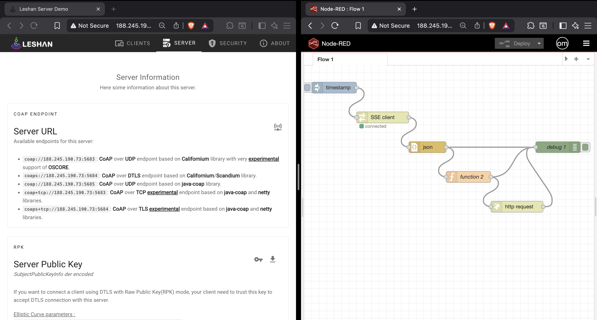

# LwM2M-local-server-demo

## LwM2M Local Server Demo

This project demonstrates how to deploy a **Lightweight M2M (LwM2M) local server** using **Eclipse Leshan** inside Docker, connect a real IoT device via **DTLS (PSK)**, and stream live telemetry to **Node-RED** using **Server-Sent Events (SSE)**.

The goal is to show how raw LwM2M data can be captured, transformed, and prepared for further integration — for example, sending JSON payloads to MQTT, from there it could be than passed to other platforms for further analytics.

### Stack
- **Eclipse Leshan** – Open-source LwM2M server  
- **Node-RED** – Low-code IoT data processing  
- **Docker Compose** – Simple service orchestration  
- **Real IoT device** – Sending temperature, humidity & concentration data  


### Example Output
```json
{
  "temperature": { "value": 22.8 },
  "humidity": { "value": 45.6 },
  "concentration": { "value": 809.0 }
}
```

### Highlights
- LwM2M device registration via PSK
- Live telemetry through Leshan SSE API
- Node-RED function for clean JSON transformation
- Simple and portable Docker setup



### Author: Omar Cruz
IoT Engineer | Based in Belgium 🇧🇪
